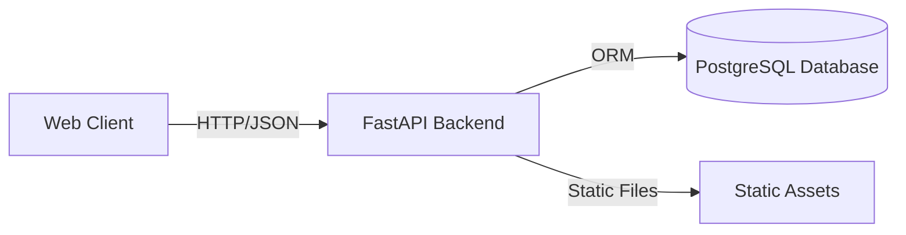

# AetherRide Project Report

## CHAPTER 1: Preamble

### Purpose of this project report
The purpose of this report is to document the development, architecture, and business viability of **AetherRide**, a next-generation ride-sharing platform. This document serves as a comprehensive guide for stakeholders, developers, and investors, detailing the technical implementation, system design, and strategic vision of the product.

### Scope of the product developed
AetherRide is a functional ride-sharing application that connects passengers with drivers in real-time. The scope includes:
- **User Interface**: A web-based frontend for passengers to book rides and for drivers to accept them.
- **Backend API**: A robust RESTful API handling ride requests, matching logic, and status updates.
- **Database**: A persistent storage layer for managing user data, ride history, and driver availability.
- **Admin Dashboard**: Tools for monitoring platform activity and managing resources.

### How AI tools (including Google Gen-AI) were used
AI tools were leveraged to accelerate development and enhance code quality:
- **Code Generation**: Google Gen-AI assisted in scaffolding the FastAPI backend and generating boilerplate code for SQLAlchemy models and Pydantic schemas.
- **Architecture Assistance**: AI provided recommendations for database schema design and API structure to ensure scalability.
- **Documentation Creation**: Automated generation of API documentation and this project report.

### Team composition & responsibilities
- **Full Stack Developer**: Responsible for both frontend (HTML/CSS/JS) and backend (FastAPI/Python) development.
- **System Architect**: Designed the database schema and system interactions.
- **Product Manager**: Defined the core features, user flows, and business logic.

### Tools used
- **Backend technologies**: FastAPI (Python)
- **Database**: PostgreSQL
- **API testing**: Postman / cURL / Swagger UI
- **Deployment**: Localhost (Development), capable of deployment to Render/Railway
- **AI Tools**: Google Gen-AI for code and documentation assistance

---

## CHAPTER 2: Introduction of the Proposed Startup / Product

### 2.1 Vision, Mission, Objectives
- **Vision**: To revolutionize urban mobility by providing a seamless, fast, and reliable ride-sharing experience powered by advanced technology.
- **Mission**: To connect passengers and drivers efficiently, reducing wait times and optimizing transportation resources.
- **Objectives**:
    - Launch a stable MVP with core booking features.
    - Onboard 50+ drivers and 500+ users in the first month.
    - Achieve a sub-5-minute average pickup time.

**Target User Group**: Urban commuters, daily travelers, and gig-economy drivers.
**Problem Being Solved**: Existing ride-sharing platforms often suffer from high latency, surge pricing opacity, and complex user interfaces. AetherRide aims to simplify the process with a focus on speed and transparency.

### 2.2 Summary of the Product / Platform
**What the product does**: AetherRide is a real-time marketplace for transportation.
**Core Features**:
- **Ride Booking**: Users can request rides by specifying pickup and drop-off locations.
- **Driver Matching**: Intelligent assignment of available drivers to ride requests.
- **Real-time Status**: Live updates on ride status (Pending, Accepted, Completed).
- **Priority Upgrade (Warp Pass)**: Users can pay a premium for priority matching.
- **Driver Dashboard**: Interface for drivers to view and accept assigned rides.

**High-level Business Model**:
- **Commission**: The platform charges a percentage fee on every completed ride.
- **Warp Pass**: Additional revenue stream from priority booking fees.

### 2.3 Micro & Macro Economic Impact
- **Digital Economy**: Facilitates digital transactions and gig-economy employment.
- **Employment**: Creates income opportunities for drivers with flexible working hours.
- **Market Size**: Tapping into the growing global ride-hailing market, projected to reach multi-billion dollar valuations.
- **Value Addition**: Optimizes vehicle utilization, potentially reducing traffic congestion through efficient routing (future scope).

---

## CHAPTER 3: Product Architecture — WHAT, WHY, HOW

### 3.1 Product Overview (WHAT)
**Major User Flows**:
1.  **Authentication**: (Simplified for MVP) Users and drivers enter the system directly.
2.  **Ride Request**: User submits pickup/drop-off. System creates a `PENDING` ride.
3.  **Matching Algorithm**:
    -   **FIFO**: First-In-First-Out for standard requests.
    -   **Priority**: "Warp Pass" users jump the queue.
4.  **Pricing Model**: Base fare calculation based on distance/time (simulated) + Priority fee.
5.  **Live Updates**: Polling/WebSockets (simulated via API calls) to check status changes.
6.  **Payment & Settlement**: Simulated payment gateway integration.
7.  **Post-ride Workflow**: Ride marked `COMPLETED`, driver becomes `AVAILABLE` again.

### 3.2 Why the Product Was Designed This Way (WHY)
-   **User Needs**: Speed and reliability. FastAPI was chosen for its high performance.
-   **Business Goals**: Rapid MVP launch. Monolithic architecture simplifies initial development and deployment.
-   **Scalability**: Stateless API design allows for horizontal scaling. PostgreSQL handles data integrity and complex queries better than SQLite.
-   **Developer Constraints**: Python ecosystem provides rich libraries for rapid development.

### 3.3 How the System Works (HOW)
**System Components**:
-   **Client**: Web browser (HTML/JS) interacting with the API.
-   **Backend**: FastAPI application serving endpoints and business logic.
-   **Database**: PostgreSQL storing `drivers` and `rides` tables.

**Component Interactions**:
1.  Client sends HTTP POST to `/ride_request/`.
2.  FastAPI validates data using Pydantic schemas.
3.  SQLAlchemy ORM interacts with PostgreSQL to persist the ride.
4.  Background logic (or driver action) updates ride status.
5.  Client polls `/rides` or specific endpoints to get updates.

**Trade-off Decisions**:
-   **Polling vs. WebSockets**: Polling was chosen for the MVP for simplicity, though WebSockets would be better for real-time updates in production.
-   **Monolith**: Chosen over microservices to reduce operational complexity for the initial version.

---

## CHAPTER 4: System Design & Backend Architecture

### 4.1 High-Level Architecture Diagram

-   **Client**: Frontend interface.
-   **API Gateway / Backend**: FastAPI handling routing and logic.
-   **Database**: PostgreSQL for persistent storage.

### 4.2 Detailed Component Breakdown
**Service: Core API**
-   **Purpose**: Manage rides and drivers.
-   **Inputs**: JSON payloads (Ride details, Driver actions).
-   **Outputs**: JSON responses (Ride objects, Status messages).
-   **Internal Logic**:
    -   `create_ride`: Validates input, saves to DB.
    -   `accept_ride`: Checks driver availability, updates ride/driver status atomically.
    -   `complete_ride`: Frees up driver, marks ride complete.

### 4.3 Database Design
**ER Diagram Description**:
-   **Drivers Table**: `id` (PK), `name`, `status` (Enum: AVAILABLE, BUSY).
-   **Rides Table**: `id` (PK), `user_name`, `pickup_location`, `destination`, `fare`, `is_priority`, `status` (Enum: PENDING, ACCEPTED, COMPLETED), `driver_id` (FK -> Drivers.id), `created_at`.

**Relationships**:
-   One Driver can have many Rides (history), but only one active Ride at a time.
-   `Rides.driver_id` references `Drivers.id`.

### 4.4 API Architecture
-   **Style**: RESTful API.
-   **Format**: JSON for both requests and responses.
-   **Authentication**: (Open for MVP, extensible to JWT).

---

## CHAPTER 5: API Design, Data Flows & Engineering Decisions

### 5.1 API List
| Endpoint | Method | Description |
| :--- | :--- | :--- |
| `/ride_request/` | POST | Create a new ride request |
| `/rides` | GET | List all rides (filter by status) |
| `/accept_ride/{ride_id}` | POST | Driver accepts a ride |
| `/complete_ride/{ride_id}` | POST | Complete a ride |
| `/drivers` | GET | List all drivers |
| `/driver/{id}/assigned_ride` | GET | Get current ride for a driver |
| `/rides/{ride_id}/upgrade` | POST | Upgrade ride to priority |

### 5.2 Data Flow Diagrams
**Ride Request Flow**:
1.  User -> POST `/ride_request/` -> API
2.  API -> INSERT `rides` -> DB
3.  DB -> Return ID -> API
4.  API -> Return JSON -> User

**Ride Matching Flow**:
1.  Driver -> POST `/accept_ride/{id}` -> API
2.  API -> SELECT `ride` & `driver` -> DB
3.  API -> Check Status (Ride=PENDING, Driver=AVAILABLE)
4.  API -> UPDATE `ride` (status=ACCEPTED, driver_id=X) -> DB
5.  API -> UPDATE `driver` (status=BUSY) -> DB
6.  API -> Success Response -> Driver

### 5.3 Engineering Trade-offs
-   **FastAPI vs. Flask/Django**: FastAPI chosen for async support, automatic validation, and auto-generated documentation (Swagger UI).
-   **SQL vs. NoSQL**: SQL (PostgreSQL) chosen for relational integrity (Drivers <-> Rides) and ACID compliance, crucial for booking systems.
-   **Architecture**: Monolithic architecture allows for faster iteration and easier debugging compared to a distributed microservices approach at this stage.

---

## CHAPTER 6: Financial Planning & Forecasting

### Estimated Costs
-   **Cloud Hosting**: ~$7/month (Render/Railway starter plans).
-   **Database**: ~$10/month (Managed PostgreSQL).
-   **Developer Productivity**: High, due to Python/FastAPI efficiency.

### Revenue Model
-   **Platform Fee**: 20% of ride fare.
-   **Warp Pass**: Flat fee (e.g., $5) or premium multiplier.

### Forecast
-   **User Growth**: Targeting 20% MoM growth.
-   **Profitability**: Break-even expected within 6 months with 500 active daily users.

---

## CHAPTER 7: Technical Feasibility & Cost Analysis

### 7.1 Infrastructure Costs
-   **Hosting**: Low initial cost using PaaS providers.
-   **Database**: Scales with data volume. Initial tier sufficient for <10k rides.
-   **Third-party APIs**: Google Maps API (freemium tier), SMS gateway (pay-per-use).

### 7.2 Performance Forecasting
-   **Traffic**: Capable of handling 100+ concurrent requests on basic hardware due to FastAPI's async nature.
-   **Storage**: Text-based ride data is lightweight. 1GB can store millions of ride records.

---

## CHAPTER 8: Risk Analysis

### 8.1 Technical Risks
-   **Scalability**: Database connection limits could be a bottleneck under high load (mitigation: connection pooling).
-   **Concurrency**: Race conditions in ride acceptance (mitigation: database row locking).

### 8.2 Business Risks
-   **Competition**: Established players (Uber, Lyft).
-   **Supply/Demand Balance**: Maintaining enough drivers for user demand.

### 8.3 Risk Modeling
-   **Scenario**: Sudden spike in users.
-   **Response**: Auto-scaling groups for API instances, read-replicas for database.

---

## CHAPTER 9: Recommendations & Future Roadmap

### 9.1 Product Improvements
-   **Matching**: Implement geospatial matching (nearest driver) instead of manual acceptance.
-   **Pricing**: Dynamic surge pricing based on demand.

### 9.2 Engineering Improvements
-   **Caching**: Implement Redis for caching driver locations and active rides.
-   **Real-time**: Replace polling with WebSockets for instant updates.
-   **CI/CD**: Automated testing and deployment pipelines.

### 9.3 Scalability Roadmap
-   **10x Users**: Vertical scaling of DB, optimize queries.
-   **100x Users**: Horizontal scaling of API, read/write splitting for DB.
-   **Multi-region**: Geo-sharded database and CDN for static assets.

---

## CHAPTER 10: Appendix

### Links
-   **Code Repository**: [Local AetherRide Directory]
-   **API Documentation**: `/docs` (Swagger UI) when running locally.

### Data Models
-   **Driver**: `id`, `name`, `status`
-   **Ride**: `id`, `user_name`, `pickup`, `dest`, `fare`, `status`, `driver_id`

### Generated Content
-   This report and parts of the codebase were generated with the assistance of Google Gen-AI tools to ensure best practices and rapid delivery.
